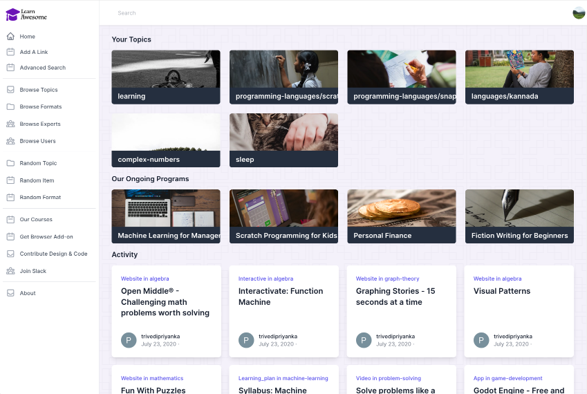
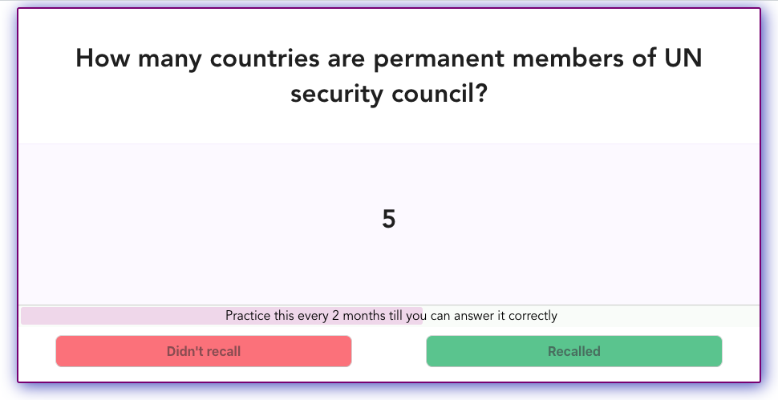
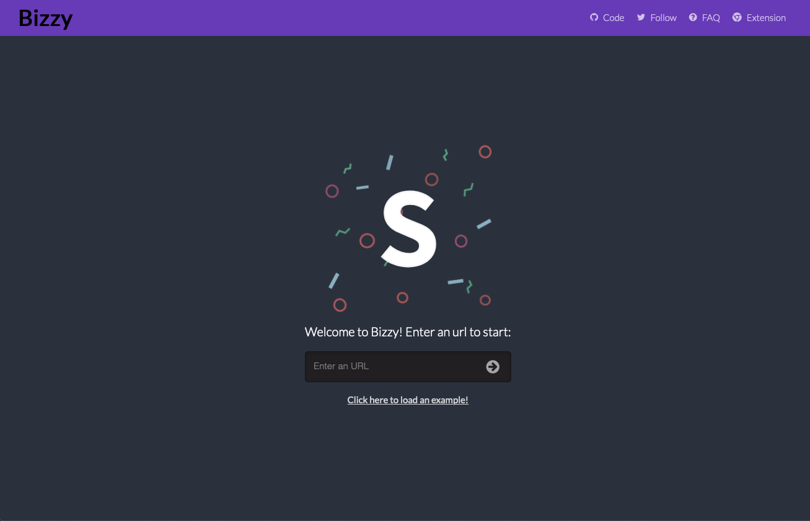
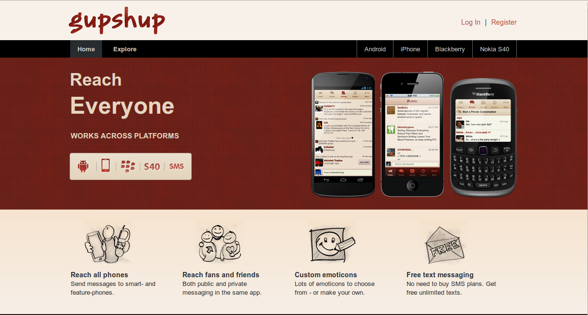
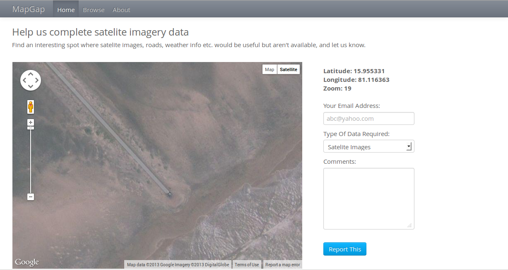
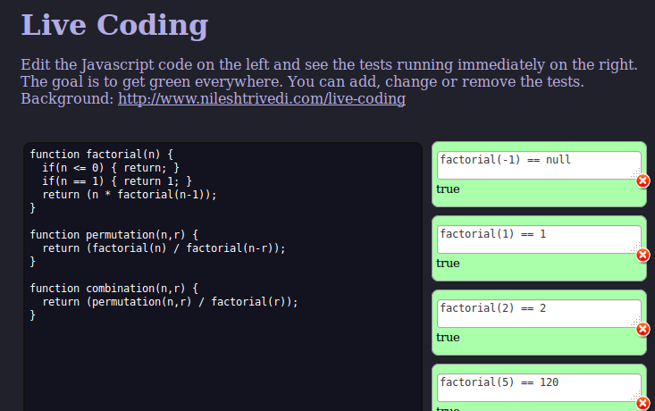

You should check out [my current projects](/now).

I started programming in 1999. Starting with C, I finished many projects with Java and Javascript before discovering and falling in love with Ruby. I co-founded a B2B startup (YouSuggest.us which was a social CRM app) and learnt a lot. The companies I have worked with include GupShup, Truweight, HyperTrack, and ClearTax among others. My skills range from web & mobile apps to electronics hardware to machine learning or algorithmic trading to topics like syllogisms, aerodynamics and mathematics behind music theory. My [resume](/Nilesh_Trivedi_CV.pdf) is here.

You can contact me via [Twitter](http://twitter.com/nileshtrivedi){:target='_blank'}.

	<h3 class="p-heading"><a href="https://learnawesome.org/about">LearnAwesome.org</a></h3>
	
	

		
This is an attempt to build a Google Maps for learning. This is a work-in-progress but it ended up getting featured by <a href="https://www.producthunt.com/posts/learnawesome">ProductHunt</a> and <a href="https://news.ycombinator.com/item?id=23795779">Hacker News</a>.
      	 		     	 
		<i>Ruby, Rails, PostgreSQL, TailwindCSS</i>
	

	<h3 class="p-heading"><a href="https://nilesh.trivedi.pw/articles/spacedrep.html">Embedded Flashcard with Spaced Repetition</a></h3>
	
	

		
This is a reusable UI widget which any webpage can embed for their readers to practice the content using spaced-repetition techniques. All progress is kept on localStorage so users do not need to sign up.
      	 		     	 
		<i>VueJS, Web Components</i>
	

	<h3 class="p-heading"><a href="https://bizzy.polyglot.network">Bizzy - responsive design testing tool</a></h3>
	
	

		
This is a fork of an old version of Sizzy that lets you test a webpage in different screen sizes.
      	 		     	 
	

	<h3 class="p-heading"><a href="https://hasgeek.tv/jsfoo/2013-2/688-interactive-physics-simulation-in-the-browser-what-i-learned">Physics</a></h3>
	
	

		
I made a <a href="https://mechasim.herokuapp.com" target="_blank">physics playground app</a> for the browser, which involved vector math, Runge-Kutta integration, impulse-based constraint solver and drawing with HTML5 Canvas API. I gave <a href="https://hasgeek.tv/jsfoo/2013-2/688-interactive-physics-simulation-in-the-browser-what-i-learned" target="_blank">a tech talk about this at JSFoo 2013</a>.
      	 		     	 
<i>Javascript, Canvas API, Mozilla Persona</i>
	

	<h3 class="p-heading"><a href="https://gupshup.me/">GupShup</a></h3>
	
	

		
I was tech lead with them from 2009 to 2013, building the enterprise platform serving 35 million users and sending out 2 billion messages every month.

<i>Ruby, Rails, Android, Facebook API</i>
	

	<h3 class="p-heading">MapGap</h3>
	
	

		
I made this app at <a href="http://spaceappschallenge.org/" target="_blank">NASA Space Apps Challenge</a> at Delhi in April 2013. It allows you to submit spots in the planet to NASA where satelite imagery is needed but missing.

	<i>Ruby, Sinatra, MongoDB & Google Maps API</i> 
	

	<h3 class="p-heading">BugRoulette</h3>
	
	

		
I made this app for events like <a href="http://pullathon.com/" target="_blank">Pullathon</a>. It lets you randomly browse open issues from GitHub repositories that you follow.

		<i>Ruby, Sinatra, GitHub, OAuth</i>
	

	<h3 class="p-heading"><a href="http://www.nileshtrivedi.com/livecoding_js_demo/">Live Coding</a></h3>        		
	
	

		
Inspired from <a href="http://vimeo.com/36579366" target="_blank">Bret Victor's famous talk</a>, I made this prototype for live coding. The idea is that as you code, the tests are run automatically and their status is immediately visible to the programmer.

			<i>Javascript</i>
	

